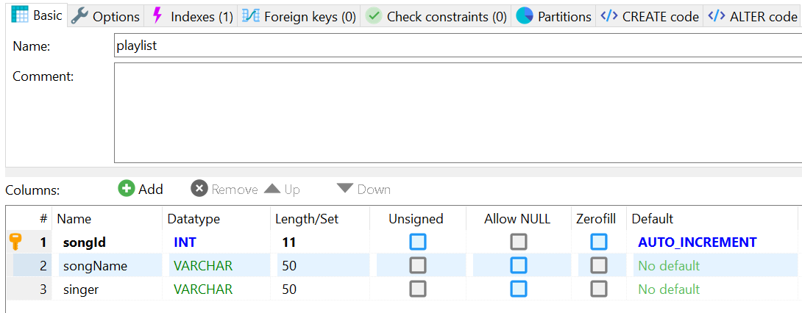

# Hibernate workshop
### Some tutorials to master Hibernate framework.
<br>

### Helper class
* * *

`HibernateUtils.java` is a helper class with some useful methods:
- doInTransaction(Consumer<Session> action) executes some action in a transaction block (ie, save operation).
> ```
>  doInTransaction(session -> {
>    clearPlaylistTable(session);
>    updateAutoIncrement(session, 1);
>  });
> ```

### Model: Song
* * *

Below, we see the mappings between the `Song` class and the `playlist` table in MariaDb.
```
@Entity
@Table(name = "playlist")
public class Song {
    @Id
    @GeneratedValue(strategy = GenerationType.IDENTITY)
    @Column(name = "songId")
    private int id;

    @Column(name = "songName")
    private String songName;

    @Column(name = "singer")
    private String artist;
}
```



### Save a song in a table with Hibernate
* * *

1. Open a SessionFactory
    > `SessionFactory sf = HibernateUtils.getSessionFactory();`
2. Using the SessionFactory, open a session
    > `Session session = sf.openSession();`
3. Create an object
    > ```
    > Song song1 = new Song();
    > song1.setSongName("songName1");
    > song1.setArtist("artist1");
    > System.out.println(song1);
    > ```

4. Save the object in a transaction
    > ```
    > Transaction transaction = session.beginTransaction();
    > session.persist(song1);
    > transaction.commit();
    > ```

[Complete code](https://github.com/vocaltech/hibernate-training/blob/master/src/main/java/fr/vocaltech/hibernate/HibernateApp.java)